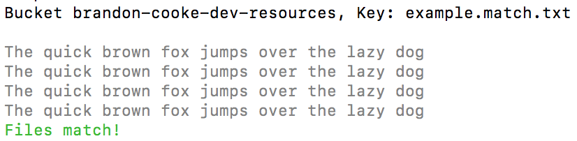
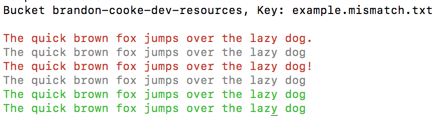

# node-diff-local-to-s3
Node app that takes a local filepath and s3 url and dynamically diffs the content on your cli.

## Author: Brandon Cooke

## Examples

#### Syntax

```
node app \ 
  -l <absolute or relative path to local file> \
  -s <s3 url [s3://bucket/key]>
```
Both command options are required.

#### Working Examples

```bash
# run from root of project
echo 'compare same file content' 
node app -l ./example/example.compare.txt -s s3://brandon-cooke-dev-resources/example.match.txt
```

**results**



```bash
echo 'compare non-matching content'
node app -l ./example/example.compare.txt -s s3://brandon-cooke-dev-resources/example.mismatch.txt
```

**results**



#### Mock Examples (NOTE these won't work if you simply throw them into cli, it's only for show)

```bash
# absolute path
node app -l /Users/brandoncookedev/helloworld.txt -s s3://testbucket/helloworld.txt

# relative path
node app -l ../Documents/helloworld.txt -s s3://testbucket/helloworld.txt
```